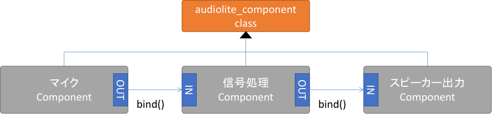
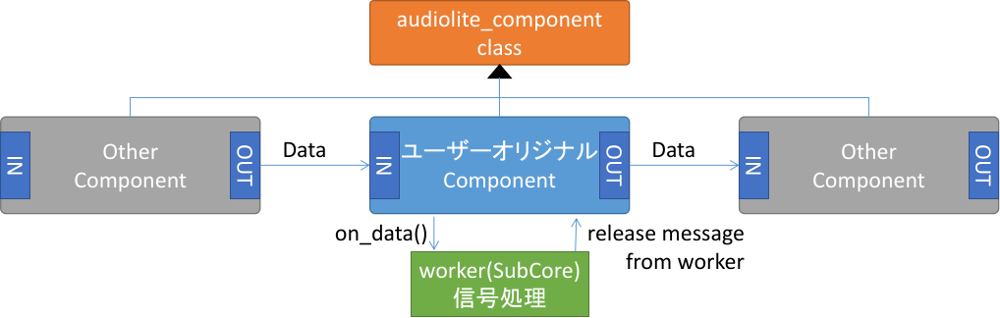
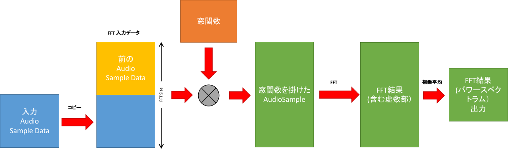
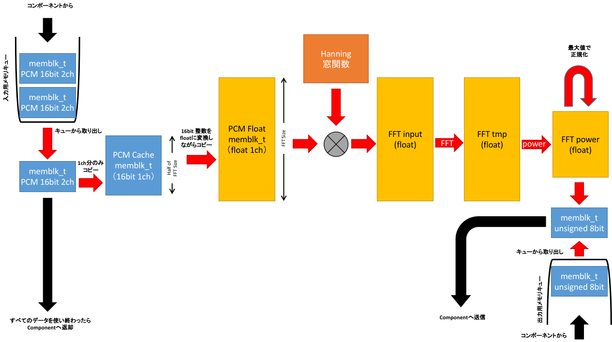
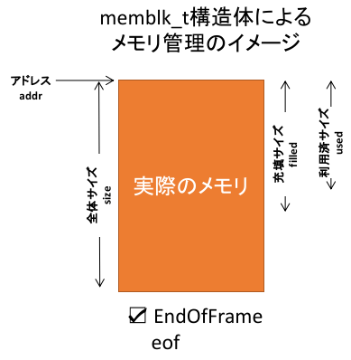
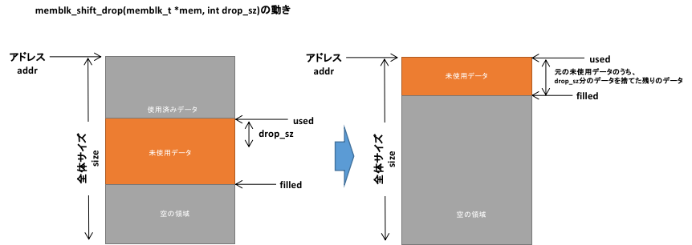

> [!NOTE]
> This tutorial is written in [English section](#english-section) after Japanese section.

## AudioLite オリジナルコンポーネント作成チュートリアル

### 概要説明

このチュートリアルでは、Spresense SDK で提供されているmkalwcomp.pyを用いて、
AudioLiteでサブコアを用いた独自の信号処理を実装するための説明を行います。
このチュートリアルを通して、audiolite_fftサンプルコードと全く同じ動作をするアプリを作成します。

AudioLiteはコンポーネントと呼ばれる機能モジュールを組み合わせることで、
アプリケーションが行いたいAudioの信号処理のデータフローをランタイムに構築し、
実行するためのフレームワークです。


コンポーネント接続例：マイク入力からの音に対して、信号処理を行い、スピーカーに出力



コンポーネントはユーザーも自由に作成することが出来、作成したコンポーネントを、
信号処理のデータフローに組み込むことでオリジナルな信号処理を追加することが出来ます。

コンポーネントは内部でSpresenseが持つサブコアを利用することで、
処理をオフロードすることも出来ます。

Worker(SubCore)を用いたコンポーネント



#### mkalwcomp.py コマンド

上記の図にある、 **ユーザーオリジナルコンポーネント（サブコア付き）** と **Worker(SubCore)** のペアの実装のテンプレート出力をするツールが、
**mkalwcomp.py** になります。

#### 作成するプログラム

このチュートリアルでは、mkalwcomp.py コマンドを用いてコンポーネントのテンプレートコードを出力し、
FFTを行って、音の周波数解析をUARTで出力するプログラムを作成します。

### 作成するコンポーネントの設計

まず、どのような信号処理を行うコンポーネントを作成するかですが、
入力されたAudioのサンプルにFFTで周波数成分に直し、スペクトル強度を算出して
出力する、というコンポーネントにします。

FFTは信号の一部を切り出して、その信号が周期的な信号であると仮定して周波数分析を行う手法です。
したがって、切り出した信号の両端がスムーズに連携していないと実在しない高周波成分が乗ってしまうことになります。
そこで、窓関数を掛けて、周期的に連続するような信号に加工してからFFTをかけるのが一般的です。
窓関数には色々ありますが、よく使われる窓関数の一つ、Hanning窓を利用します。 [参考](https://en.wikipedia.org/wiki/Window_function)

ただし、窓関数をかけると切り出した信号の両端の信号が礫れしまいます。
この副作用を抑えるためによく用いられる手法として、切り出すサイズを半分づつずらしてFFTをかけます。
これによって、潰れる信号を極力抑えることが可能となります。

以上のことから、
FFTを行うコンポーネントの信号処理の概要は以下のような仕様になります。



計算し終わったパワースペクトラムを後段のコンポーネントに渡します。
パワースペクトラムは、FFTサイズに対して半分のデータ数となります。
FFTの計算が終わったら、次の入力データ用に図の **FFT 入力データ** の上半分を消し下半分のデータを上にシフトさせ、
新たな入力データに備えます。

今回は演算部分をSubcore（SDKではWorkerと呼びます）で行います。
そのため、Workerは入力 Audio Sample Dataが格納された入力メモリと演算結果の出力メモリを、自作するAudioLite Componentから受け取り、
入力メモリを使い終わるか、出力メモリに結果を書き終えたら、それぞれのメモリをComponentに戻します。
Component側はそれぞれのメモリを次のコンポーネントに渡します。

### コンポーネントのテンプレート作成

それでは、まずはコンポーネントのテンプレートを作成しましょう。
なお、現時点(Spresense SDK v3.3.0)では、これらのコマンドはCLI環境でのみ動作します。
VSCodeを用いている場合、VSCode内でターミナルを開き、spresenseディレクトリに移動してください。

#### ツール郡のパスを通す。

まずは、ツールを利用する上で、そのツールのパスを通す必要があります。

spresense/sdkディレクトリに移動し、プロンプトから以下のコマンドを実行してください。

```shell
source tools/build-env.sh
```

これで必要なツールが利用できるようになりました。

#### NuttShell コマンドコードの作成

続いてNuttShellのコマンドを作成します。
> [!NOTE]
> NuttShellのコマンドとは、ビルド後、nuttx.spkを焼き込んだ後、実機側のターミナルプロンプト ```nsh> ``` で入力するコマンドのことです。

同じくspresense/sdkディレクトリの中で、以下のコマンドを実行します。
今回のコマンド名は、 **alfft** とします。

```shell
./tools/mkcmd.py -x alfft
```

mkcmd.pyはNuttShellのコマンド実装のテンプレートコードを生成してくれるコマンドです。
オプション引数 ```-x``` は、C++のテンプレートを生成することを意味しています。
その後の ```alfft``` がコマンド名となります。
> [!NOTE]
> AudioLiteはC++のライブラリのため、C++のテンプレートを出力するようにします。

このコマンドを実行すると、spresense/examplesディレクトリ以下にalfftというディレクトリが出来、
その中にビルドに必要なMakefileを含むテンプレートファイル群が生成されます。

spresense/examples/alfftディレクトリに移動し、lsコマンドで生成されたファイル群を見てみてください。

```shell
cd ../examples/alfft
ls
```

すると、以下のようなファイルが見えます。

```
Kconfig  Make.defs  Makefile  alfft_main.cxx  configs/
```

これらのファイルの内容は以下の表にまとめておきます。

| File名         | 内容 |
| -------------- | ---- |
| Kconfig        | このコマンドをビルド対象とするかしないかを選択するConfig用の定義ファイル。（デフォルトはビルド対象とするようになっている） |
| Make.defs      | ビルドシステムが利用するファイル |
| Makefile       | 実際にビルド対象となるソースコードファイルやGCCの引数などのオプションを記載するファイル |
| alfft_main.cxx | 今回作成するalfftコマンドのエントリー関数（main()関数）が実装されるソースファイル |
| configs/       | このコマンド特有のConfig設定を保存するためのフォルダ |


#### AudioLite ComponentとそのWorkerテンプレートの生成

作成したalfftコマンドの中で、FFTを行うWorkerとそれを制御するオリジナルなAudioLite Componentを作成します。

先程移動した、spresense/examples/alfftの中で、以下のコマンドを実行してください。

```shell
mkalwcomp.py fft
```

このコマンドを実行すると、以下のようなログが出力されます。

```
=== Generating audiolite worker component in .
 [G] Generate ./fft/Makefile
 [G] Generate ./fft/.gitignore
 [G] Generate ./fft/alworker_commfw_config.h
 [G] Generate ./fft/fft_worker_main.h
 [G] Generate ./fft/fft_worker_main.c
 [G] Generate ./alusr_fft.h
 [G] Generate ./alusr_fft.cxx
 [C] Save ./Makefile to ./Makefile_org
 [M] Modify ./Makefile
Done in successfly
```

結果として、spresense/examples/alfftの下に、 AudioLite Componentのコードが生成されると同時に、
fftというサブフォルダに、Worker側の独立したバイナリを作成するために必要なコードが作成されます。

```shell
ls
```

lsの実行結果
```
Kconfig  Make.defs  Makefile  Makefile_org  alfft_main.cxx  alusr_fft.cxx  alusr_fft.h  configs/  fft/
```

```shell
ls fft
```

ls fftの実行結果
```
Makefile  alworker_commfw_config.h  fft_worker_main.c  fft_worker_main.h
```

生成されたファイルとその内容を以下の表にまとめておきます。

| File名                       | 内容 |
| ---------------------------- | ---- |
| alusr_fft.cxx                | Workerであるfftと連携するAudioLite Componentのクラス実装 |
| alusr_fft.h                  | alusr_fftクラスのヘッダファイル |
| Makefile_org                 | 元のMakefileのコピー。mkalwcomp.pyは、alusr_fft.cxxとworkerのビルドを行えるようMakefileを修正している |
| fft/Makefile                 | fft worker 側のビルドを行うためのビルドスクリプト |
| fft/alworker_commfw_config.h | audiolite workerを手軽に実装できるようにしたフレームワークの設定ファイル |
| fft/fft_worker_main.c        | fft workerのソースコード（C言語） |
| fft/fft_worker_main.h        | fft workerとalusr_fftコンポーネントとの共通情報を記載するためのヘッダファイル |

### 実装

テンプレートファイルが生成されたので、
実際に目的の信号処理を行うコードの実装を行います。

生成されたテンプレートファイルの中で、今回のチュートリアルで編集するファイルと編集内容は以下のようになります。

| 編集するFile名               | 内容 |
| ---------------------------- | ---- |
| fft/fft_worker_main.h        | fft workerとalusr_fftコンポーネントとの共通情報として、FFTのサイズの定義を記載する |
| fft/fft_worker_main.c        | 信号処理を実装する。入力Audio Sample DataをFFTを行うサイズに切り取ってFFTを掛け、出力メモリに出力する |
| alusr_fft.cxx                | Workerに渡す出力用メモリのサイズをFFTの出力サイズに変更する |
| alfft_main.cxx               | alusr_fftをaudioliteのマイク入力コンポーネントと組み合わせてFFT結果をコンソール出力するアプリの大枠の実装を行う |

> [!NOTE]
> 実装の説明に入る前に、[memblk_t](#memblk_t) の章をを読んでおいてください。
> ComponentからWorkerへ送られるメモリは、 memblk_tという構造体にラップして扱います。
> この構造体は、メモリのアドレスを管理するだけでなく、溜まっているデータをどの程度消費したか（使ったか）、
> また、空のメモリに対してどの程度データを溜めたか、などの管理を容易にするための構造体です。
> [memblk_t](#memblk_t)の章でその使い方を詳しく解説しています。

#### fft/fft_worker_main.hの編集

ではまず、alusr_fftコンポーネントとfft workerで共通の情報をfft/fft_worker_main.hに記述します。
生成された直後のファイルの中身は以下のようになっています。

```c:fft/fft_worker_main.h
#ifndef __AUDIOLITE_WORKER_USR_FFT_H
#define __AUDIOLITE_WORKER_USR_FFT_H

/* Add a common definition between worker and the audiolite component here */

#define FFT_WORKER_VERSION (1)

#endif /* __AUDIOLITE_WORKER_USR_FFT_H */
```

これに対して、FFTのサイズ：FFT TAP数と、その半分の値の定義を記載します。
固定の整数値の定義となるので、defineマクロを用いて、以下のように記載します。

```c
#define FFT_TAPS      (512)
#define FFT_TAPSHALF  (FFT_TAPS / 2)
```

これをfft/fft_worker_main.hに追記します。
編集した結果、以下のようになります。

```c:fft/fft_worker_main.h
#ifndef __AUDIOLITE_WORKER_USR_FFT_H
#define __AUDIOLITE_WORKER_USR_FFT_H

/* Add a common definition between worker and the audiolite component here */

#define FFT_WORKER_VERSION (1)

#define FFT_TAPS      (512)
#define FFT_TAPSHALF  (FFT_TAPS / 2)

#endif /* __AUDIOLITE_WORKER_USR_FFT_H */
```

これで、fft/fft_worker_main.hの編集は完了です。

#### fft/fft_worker_main.cの編集

それでは、信号処理本体の実装に入ります。
まず、編集前のfft/fft_worker_main.cの中身は以下のようになります。
（一部抜粋しています。）

```c:fft/fft_worker_main.c
/****************************************************************************
 * Included Files
 ****************************************************************************/

#include <asmp/stdio.h>
#include <alworker_commfw.h>
#include "fft_worker_main.h"

/****************************************************************************
 * Private Data Types
 ****************************************************************************/

struct my_worker_instance_s
{
  /* ALWORKERCOMMFW_INSTANCE should be on top of your instance */

  ALWORKERCOMMFW_INSTANCE;

  /* Add specific items for your application here */
};

/****************************************************************************
 * Private Data
 ****************************************************************************/

static struct my_worker_instance_s g_instance;

// ... <抜粋> ...

/****************************************************************************
 * Private Functions
 ****************************************************************************/

// ... <抜粋> ...

static int on_process(void *arg)
{
// ... <抜粋> ...
}

/****************************************************************************
 * Public Functions
 ****************************************************************************/

int main(void)
{
// ... <抜粋> ...
}
```

このファイルでは、ヘッダのインクルードをした後、このWorkerの独自の構造体、```struct my_worker_instance_s``` が定義され、
その後、その構造体のインスタンス、```g_instance``` 変数が定義されています。
その後、on_process()関数と、main()関数が記述されています。

on_process()関数は、Workerの起動が始まり、Componentから信号処理開始指示が来ると実行される関数になります。
Componentから終了指示が来るまで、on_process()が呼ばれ続けます。（arduinoのloop()に似ています。）
main()関数は、Workerのエントリ関数で、Workerがメモリにロードされると実行される関数になります。
この関数では、各種初期化を行い、その後、alworker_commfw_msgloop()を呼び出すことで、Componentからの指示にしたがって適宜処理を行います。

今回、FFTの演算には、ARM社製のCMSISライブラリを用います。
そのため、まずはヘッダファイルとして、arm_math.hをインクルードしておきます。
```c
#include <asmp/stdio.h>
#include <alworker_commfw.h>
#include "fft_worker_main.h"

#include "arm_math.h"  /* 追加 */
```

データパスの設計ですが、信号処理の概要として記載した図に対して、更に具体的になデータパスは以下のようになります。



入力Audio Sample Dataと出力用メモリは任意のサイズでComponentから送られてきます。
入力Sampleは2chのステレオデータで来るため、これを1ch分でFFT_TAPSHALFサイズ分になるまでPCM Cacheに蓄えます。
PCM Cacheがいっぱいになったら、これを16bit整数から32bit 浮動小数点に変換を行いながらPCM Floatメモリにコピーします。
その後、窓関数を掛けてFFTを行い、パワースペクトルを算出します。最後に最大値で正規化して、出力メモリに結果を書き出します。

出力メモリへの書き出しが完了したら、
次の入力データに備えて、PCM Floatの半分のデータを切り捨て、PCM Cacheを空にして、１回分の信号処理は完了となります。

この処理をon_process()関数の中で実施します。

では、まずは必要なデータの定義を行います。

入力データはmemblk_t構造体にラップされた形で受け取ります。
入力データのサイズは任意であるため、キューから取り出したメモリを一時的に保持しておく必要があります。
そこで、struct my_worker_instance_s 構造体に、memblk_t *pcm_inメンバとして、ポインタで定義します。
```c
  memblk_t *pcm_in;
```
また、図中のPCM Cache、PCM Floatも溜まったデータの量を管理するため、ローカルなmemblk_t構造体で管理します。
そのために、更に２つのmemblk_tを今度は実態として定義します。
```c
  memblk_t pcm_cache;
  memblk_t pcm_float;
```

FFTの計算には、ARM社製のCMSISを用います。WorkerではCMSISを利用することができるようになっています。
CMSISのFFTにはその演算のためのインスタンスが必要になります。今回、32bit浮動小数点での演算を行うので、
arm_rfft_fast_instance_f32型のインスタンスが必要になります。
```c
  arm_rfft_fast_instance_f32 rfft;
```

追加するメンバは以上となります。
これらを構造体の中に記載していくと、struct my_worker_instance_sは、
```c:struct my_worker_instance_s
struct my_worker_instance_s
{
  /* ALWORKERCOMMFW_INSTANCE should be on top of your instance */

  ALWORKERCOMMFW_INSTANCE;

  /* Add specific items for your application here */

  memblk_t *pcm_in;

  memblk_t pcm_cache;
  memblk_t pcm_float;

  arm_rfft_fast_instance_f32 rfft;
};
```
となります。

続いてメモリインスタンスです。
詳細なデータパスの図にあるように、

* 16bit整数でサイズがFFT_TAPSHALFのメモリ x 1
* 32bit浮動小数点でサイズがFFT_TAPSのメモリ x 3
* 32bit浮動小数点でサイズがFFT_TAPSHALFのメモリ x 1

の合計5枚のメモリとそれに加えて、窓関数用に、

* 32bit浮動小数点でサイズがFFT_TAPSのメモリ x 1

が必要になります。
これらをstaticなメモリとして実態を記載します。
> [!NOTE]
> my_worker_instanc_sにpcm_cache、pcm_floatをmemblk_t型で定義しましたが、memblk_tはあくまでメモリをラップする構造体のため、メモリそのものの実態は別に定義する必要があります。

```c
static short pcm_cache_mem[FFT_TAPSHALF];
static float pcm_float_mem[FFT_TAPS];

static float fft_input[FFT_TAPS];
static float fft_window[FFT_TAPS];
static float fft_tmp[FFT_TAPS];
static float fft_power[FFT_TAPSHALF];
```

これをPrivate Dataのエリアに追記します。

```c
/****************************************************************************
 * Private Data
 ****************************************************************************/

static struct my_worker_instance_s g_instance;

static short pcm_cache_mem[FFT_TAPSHALF];
static float pcm_float_mem[FFT_TAPS];

static float fft_input[FFT_TAPS];
static float fft_window[FFT_TAPS];
static float fft_tmp[FFT_TAPS];
static float fft_power[FFT_TAPSHALF];
```

なお、テンプレート作成時に記載されている、以下の２行は今回は使用しないため削除してください。

```c
static memblk_t *imem_inuse = NULL;
static memblk_t *omem_inuse = NULL;
```

信号処理の実装を始める上で、２つの関数を追加します。
* void init_hanningw(float *dat, int len)
* void calc_fft(struct my_worker_instance_s *inst, memblk_t *out

まずは、init_hanningw()関数です。
この関数は、lenで指定されたサイズのfloat配列に対してhanning窓を計算します。

```c
static void init_hanningw(float *dat, int len)
{
  int i;
  float weight;

  for (i = 0; i < len / 2; i++)
    {
      weight = 0.5f *
               (1.0f - arm_cos_f32(2 * PI * (float)i / len));
      dat[i] = weight;
      dat[len - (i + 1)] = weight;
    }
}
```

続いて、calc_fft()関数です。
この関数は、pcm_floatを入力として、窓関数を掛け、FFTを行い、Powerスペクトルの算出と最大値による正規化を行い、
outで指定されたmemblk_tに8bit 整数値としてその結果を書き出します。
演算のほとんどはCMSISの関数になります。詳しくは [ARM CMSIS](https://arm-software.github.io/CMSIS_6/latest/General/index.html) のリファレンスマニュアルを参照してください。

```c
static void calc_fft(struct my_worker_instance_s *inst, memblk_t *out)
{
  uint32_t i;
  float max;
  float *pcm = (float *)memblk_dataptr(&inst->pcm_float);

  /* Calculate FFT with log */

  arm_mult_f32(pcm, fft_window, fft_input, FFT_TAPS);
  arm_rfft_fast_f32(&inst->rfft, fft_input, fft_tmp, 0);
  arm_cmplx_mag_f32(fft_tmp, fft_power, FFT_TAPSHALF);

  /* Normalize */

  arm_max_f32(fft_power, FFT_TAPSHALF, &max, &i);
  arm_scale_f32(fft_power, 255.f/max, fft_power, FFT_TAPSHALF);

  /* Store result */

  memblk_reset(out);
  for (i = 0; i < FFT_TAPSHALF && !memblk_is_full(out); i++)
    {
      memblk_push_uint8(out, (uint8_t)fft_power[i]);
    }
}
```

calc_fft()関数は、詳細図の黄色で示したメモリブロックを使った信号処理をすべて行っていることになります。

このファイルの編集も残りは、on_process()関数とmain()関数のみになります。

on_process()関数では、入出力のメモリブロックの管理と、pcm_cacheへのデータの詰め込み、
pcm_floatへの変換と、calc_fft()を呼び出しての信号処理を行います。

最初にテンプレートで出力されたon_process()関数の中身を削除します。
変数へのキャストのみ残し、一旦以下のようにします。

```c
static int on_process(void *arg)
{
  struct my_worker_instance_s *inst =
    (struct my_worker_instance_s *)arg;

  return AL_COMMFW_RET_OK;
}
```

入力メモリはpcm_inメンバ変数で保持・管理しますが、出力メモリはこの関数内でのみテンポラリで管理します。
そこで、ローカル変数として、以下の変数を定義します。

```c
  memblk_t *fft_out;
```

まずは入力メモリブロックを入力メモリキューから取得して、pcm_cacheにデータがいっぱいになるまで入力メモリブロックからデータをコピーします。
入力メモリブロックが空になったらその時点でメモリをComponentに返します。

入力メモリキューからメモリブロックを取得するには、```TAKE_IMEM()``` を用います。
pcm_cacheにデータが満タンになっていない状況で入力メモリキューにメモリブロックがなければ、
一旦、 return AL_COMMFW_RET_OK; としてon_process()関数から抜け、Componentからのメッセージ処理を行うようにします。
> [!NOTE]
> on_process()関数は、main()関数の最後で呼び出しているalworker_commfw_msgloop()関数の中から呼び出されている関数で、
> このalworker_commfw_msgloop()関数内で、Componentからのメッセージ処理も行っています。
> そのため、適宜on_process()関数から抜けていかないと、Componentからのメッセージ処理が出来ず、デッドロックやMICなどのDMAのOverflowを引き起こす場合があります。

Componentからのメモリブロックを受け取ったら、memblk_single16()関数を使って、pcm_inからpcm_cacheに1ch分のメモリをコピー出来るだけコピーします。
その後、pcm_inに入っているデータをすべて使い切ったかをチェックし、使い切っていたらメモリブロックをComponentに返却します。
Componentへ返却するのは、FREE_MEMBLK()を使います。

全体をwhile(!memblk_is_full(&inst->pcm_cache))でくくることで、pcm_cacheが満タンになるまでこの状況を繰り返します。

```c
  while(!memblk_is_full(&inst->pcm_cache))
    {
      if (inst->pcm_in == NULL)
        {
          inst->pcm_in = TAKE_IMEM(inst);
          if (inst->pcm_in == NULL)
            {
              return AL_COMMFW_RET_OK;  /* Wait for PCM data */
            }
        }

      memblk_single16(&inst->pcm_cache, inst->pcm_in);
      if (memblk_is_empty(inst->pcm_in))
        {
          FREE_MEMBLK(inst->pcm_in, inst);
          inst->pcm_in = NULL;
        }
    }
```

pcm_cacheが満タンになると、このwhile()節の下の処理が進みます。
16bit 1ch、FFT_TAPSHALFサイズ分のデータがpcm_cacheに溜まったので、FFTの演算を行って行きます。
まず、出力するメモリブロックをキューから取得します。出力メモリブロックの取得は、TAKE_OMEM()を使います。
出力メモリブロックが無い場合、入力メモリブロック同様、```return AL_COMMFW_RET_OK;```としてon_process()関数から抜けます。
この状態では、pcm_cacheは満タンのままになるので、次にon_process()が呼ばれた場合であっても、前段のwhile()文は条件不一致で処理されず、
出力メモリブロックの取得の部分から処理が再開します。
出力メモリブロックが確保出来たら、```memblk_shift_drop()```関数でpcm_floatの古いデータ半分を捨て、```memblk_conv_pcm16tofloat()```関数でpcm_cacheのデータをfloatに変換しながらpcm_floatにコピーします。
pcm_floatへのコピーが完了したら、先程作成した```calc_fft()```関数を呼び出し、パワースペクトルを計算し、結果をfft_outメモリブロックに格納します。
結果の格納が終わったfft_outをFREE_MEMBLK()を用いてComponentに返却し、次の演算に備えてpcm_cacheを空にして、on_process()関数は終了となります。

```c
  fft_out = TAKE_OMEM(inst);
  if (fft_out == NULL)
    {
      return AL_COMMFW_RET_OK;  /* Wait for memory to output */
    }

  memblk_shift_drop(&inst->pcm_float, sizeof(float) * FFT_TAPSHALF);
  memblk_conv_pcm16tofloat(&inst->pcm_float, &inst->pcm_cache);
  calc_fft(inst, fft_out);

  FREE_MEMBLK(fft_out, inst);
  memblk_reset(&inst->pcm_cache);
```

これでon_process()関数の編集は完了です。上記の通り変更を加えた結果のon_process()関数は以下のようになります。

```c
static int on_process(void *arg)
{
  memblk_t *fft_out;
  struct my_worker_instance_s *inst =
    (struct my_worker_instance_s *)arg;

  while(!memblk_is_full(&inst->pcm_cache))
    {
      if (inst->pcm_in == NULL)
        {
          inst->pcm_in = TAKE_IMEM(inst);
          if (inst->pcm_in == NULL)
            {
              return AL_COMMFW_RET_OK;  /* Wait for PCM data */
            }
        }

      memblk_single16(&inst->pcm_cache, inst->pcm_in);
      if (memblk_is_empty(inst->pcm_in))
        {
          FREE_MEMBLK(inst->pcm_in, inst);
          inst->pcm_in = NULL;
        }
    }

  fft_out = TAKE_OMEM(inst);
  if (fft_out == NULL)
    {
      return AL_COMMFW_RET_OK;  /* Wait for memory to output */
    }

  memblk_shift_drop(&inst->pcm_float, sizeof(float) * FFT_TAPSHALF);
  memblk_conv_pcm16tofloat(&inst->pcm_float, &inst->pcm_cache);
  calc_fft(inst, fft_out);

  FREE_MEMBLK(fft_out, inst);
  memblk_reset(&inst->pcm_cache);

  return AL_COMMFW_RET_OK;
}
```

最後にmain()関数の編集になります。
ここでは、my_worker_instance_s構造体のメンバの初期化を行います。
以下のフレームワークに関連した構造体メンバの初期化の後ろに、今回追加したpcm_in, pcm_cache, pcm_float, rfftメンバの初期化と、
hanning窓の初期化を行います。

```c
  if (alworker_commfw_initialize((alworker_insthead_t *)&g_instance) != OK)   
    {
      return 0;
    }
```

上記の後ろに各メンバの初期化を追記します。

```c
  if (alworker_commfw_initialize((alworker_insthead_t *)&g_instance) != OK)   
    {
      return 0;
    }

  g_instance.pcm_in = NULL;
       
  memblk_init(&g_instance.pcm_cache, (char *)pcm_cache_mem, sizeof(pcm_cache_mem));
  memblk_init(&g_instance.pcm_float, (char *)pcm_float_mem, sizeof(pcm_float_mem));                                                                           
  arm_rfft_fast_init_f32(&g_instance.rfft, FFT_TAPS);
  init_hanningw(fft_window, FFT_TAPS);
```

以上でmain()関数の変更は終了です。
変更後のmain()関数は以下のようになります。

```c
int main(void)
{
  alcommfw_cbs_t *cbs = alworker_commfw_get_cbtable();

  if (alworker_commfw_initialize((alworker_insthead_t *)&g_instance) != OK)   
    {
      return 0;
    }
           
  g_instance.pcm_in = NULL;
       
  memblk_init(&g_instance.pcm_cache, (char *)pcm_cache_mem, sizeof(pcm_cache_mem));
  memblk_init(&g_instance.pcm_float, (char *)pcm_float_mem, sizeof(pcm_float_mem));                                                                           
  arm_rfft_fast_init_f32(&g_instance.rfft, FFT_TAPS);
  init_hanningw(fft_window, FFT_TAPS);                
  
  SET_PROCESS(cbs, on_process);
                           
  alworker_send_bootmsg(FFT_WORKER_VERSION, NULL);
                                                     
  alworker_commfw_msgloop((alworker_insthead_t *)&g_instance);

  return 0;
}
```

以上でfft/fft_worker_main.cの編集はすべて完了となります。

#### alusr_fft.cxxの編集

Worker側の実装が完了したので、残りはComponentの編集とComponentをマイクと接続し、
マイク入力をFFT解析するコマンド（アプリ）を実装します。

まずは、alusr_fftクラスの実装ファイルの編集です。
このファイルでは、alusr_fftクラスのコンストラクタが実装されており、
その中で、固定長メモリプールを定義しています。
このメモリプールのメモリブロックは、FFTの出力用メモリブロックとなります。
今回、FFTの結果は、8bit 整数で、FFT_TAPSHALFサイズになります。
そこで、個々のブロックサイズをこのサイズにします。
具体的には、コンストラクタの中で呼び出している、_outmempool->create_instance()の第1引数を4096から変更します。

```c
alusr_fft::alusr_fft() :
  audiolite_workercomp("fft", 8, 8), _outmempool(NULL)
{
  set_msglistener(&_msglsnr);
  _outmempool = new audiolite_mempoolapbuf;
  _outmempool->create_instance(FFT_TAPSHALF, 8); // <- ここを変更
  set_mempool(_outmempool);
}
```

以上でalusr_fft.cxxの編集は完了です。

#### alfft_main.cxxの編集

最後に作成したalusr_fftコンポーネントとMICコンポーネントを組み合わせて、
マイク音声をFFTして周波数をUARTに出力するようにします。

テンプレートとして生成された中身は、何も記載のないmain()関数が定義されているのみです。

```c
#include <nuttx/config.h>
#include <stdio.h>

extern "C" int main(int argc, FAR char *argv[])
{
  return 0;
}
```

MIC入力は、audiolite_inputcomp、FFT処理は先程作成したalusr_fftを用いますが、結果の出力先が無い状態です。
そこで、データを受け取るとそのデータを表示するComponentを実装します。

audioliteの各クラスを利用するには、audiolite/audiolite.hをインクルードする必要があります。
また、今回作成したalusr_fftクラスを利用するため、alusr_fft.hも併せてインクルードします。

```c
#include <nuttx/config.h>
#include <stdio.h>

#include <audiolite/audiolite.h>
#include "alusr_fft.h"
```

続いて、結果の表示用のコンポーネントを実装します。
AudioLiteのコンポーネントを作成するには、audiolite_componentクラスを継承したクラスを定義します。
このクラスにon_data()メソッドをオーバーライドして実装すれば、bind()によって接続されたクラスからの出力データを受け取り処理することが出来ます。
クラス名はfft_showとします。

```c++
class fft_show : public audiolite_component
{
  public:
    void on_data()
    {
    };
};
```

on_data()の中で入力されたデータをpop_data()メソッドを使って取得し、
取得したメモリからデータを読み出すことで、FFTされたパワースペクトルデータを出力させることが出来ます。
今回、各周波数成分の強度（0 ~ 255）を、アスキー文字でデータ16段階で表示するようにします。
数値を16段階のアスキー文字に変換するメンバ関数gray_to_ascii()をfft_showクラスに追加し、on_data()で利用するようにします。

```c
class fft_show : public audiolite_component
{
  public:
    char gray_to_ascii(unsigned char d)
    {
      if (d < 0x10) return ' ';
      if (d < 0x20) return '.';
      if (d < 0x30) return ',';
      if (d < 0x40) return '_';
      if (d < 0x50) return '-';
      if (d < 0x60) return '~';
      if (d < 0x70) return '+';
      if (d < 0x80) return 'i';
      if (d < 0x90) return 'b';
      if (d < 0xa0) return 'p';
      if (d < 0xb0) return 'A';
      if (d < 0xc0) return 'H';
      if (d < 0xd0) return 'V';
      if (d < 0xe0) return 'O';
      return 'Z';
    };

    void on_data()
    {
     audiolite_memapbuf *mem = (audiolite_memapbuf *)pop_data();

      if (mem)
        {
          uint8_t *data = (uint8_t *)mem->get_data();

          for (int i = 0; i < 50; i++)
            {
              printf("%c", gray_to_ascii(*data++));
            }

          printf("\n");
          mem->release();
        }
    };
};
```

以上でFFTの出力結果を表示するfft_showクラスの実装は完了となります。
（メンバ関数の実装はクラス定義の外で行うのがC++言語の通例ですが、今回JAVA言語のようにクラスのメソッド定義の中で実装も記載しています。）

なお、FFTのデータはFFT_TAPSHALF分ありますが、出力しているのは最初の50個のみとしています。(on_data()のfor文のループ回数)
これは、あまりデータ量が多いとUARTの出力にかかる時間が48KHzのサンプルに対して間に合わなくなってしまい、UART出力処理がボトルネックとなり、結果としてMIC入力のオーバーフローを招くことを避けるためです。

さて、後はmain()関数で各コンポーネントをつなぎ合わせてAudio処理を開始すればSpresenseのマイク入力の音声の周波数分析結果をUARTで確認することが出来ます。

audiolite_throughサンプルにもありますが、audiolite_inputcompはマイク入力データを入れるメモリプールが必要になります。
今回、pcm_cacheがFFT_TAPSHALFサイズなので、FFT_TAPHALFサンプル数分（2ch/16bit）を保持出来るメモリサイズのメモリプールを作成してaudiolite_inputcompに取り付けます。
また、コンポーネントからのイベントを取得するためのイベントリスナーには、標準のaudiolite_simplelistenerを使います。
周波数の分析は15秒間行い、15秒経つとコマンドが終了するようにしています。
これらを条件にmain()関数を実装すると以下のようになります。

```c
extern "C" int main(int argc, FAR char *argv[])
{
  audiolite_simplelistener lsn;
  audiolite_mempoolapbuf *membool = new audiolite_mempoolapbuf;
  audiolite_inputcomp    *aindev  = new audiolite_inputcomp;
  alusr_fft              *fft     = new alusr_fft;
  fft_show               *show    = new fft_show;

  audiolite_set_evtlistener(&lsn);
  audiolite_set_systemparam(48000, 16, 2);
  membool->create_instance(FFT_TAPS * 2 * 2, 16);
  aindev->set_mempool(membool);

  aindev->bind(fft)->bind(show);
  aindev->start();

  for(int i = 0; i < 15; i++) sleep(1);

  printf("Stop audio\n");
  aindev->stop();

  aindev->unbindall();
  audiolite_eventdestroy();

  delete show;
  delete fft;
  delete aindev;
  delete membool;

  return 0;
}
```

これでalfft_main.cxxの編集は完了となり、すべての編集が完了しました。
編集結果のalfft_main.cxxは以下のようになります。

```c
#include <nuttx/config.h>
#include <stdio.h>

#include <audiolite/audiolite.h>
#include "alusr_fft.h"

class fft_show : public audiolite_component
{
  public:
    char gray_to_ascii(unsigned char d)
    {
      if (d < 0x10) return ' ';
      if (d < 0x20) return '.';
      if (d < 0x30) return ',';
      if (d < 0x40) return '_';
      if (d < 0x50) return '-';
      if (d < 0x60) return '~';
      if (d < 0x70) return '+';
      if (d < 0x80) return 'i';
      if (d < 0x90) return 'b';
      if (d < 0xa0) return 'p';
      if (d < 0xb0) return 'A';
      if (d < 0xc0) return 'H';
      if (d < 0xd0) return 'V';
      if (d < 0xe0) return 'O';
      return 'Z';
    };

    void on_data()
    {
     audiolite_memapbuf *mem = (audiolite_memapbuf *)pop_data();

      if (mem)
        {
          uint8_t *data = (uint8_t *)mem->get_data();

          for (int i = 0; i < 50; i++)
            {
              printf("%c", gray_to_ascii(*data++));
            }

          printf("\n");
          mem->release();
        }
    };
};

extern "C" int main(int argc, FAR char *argv[])
{
  int ret;

  audiolite_simplelistener lsn;
  audiolite_mempoolapbuf *membool = new audiolite_mempoolapbuf;
  audiolite_inputcomp    *aindev  = new audiolite_inputcomp;
  alusr_fft              *fft     = new alusr_fft;
  fft_show               *show    = new fft_show;

  audiolite_set_evtlistener(&lsn);
  audiolite_set_systemparam(48000, 16, 2);
  membool->create_instance(FFT_TAPS * 2 * 2, 16);
  aindev->set_mempool(membool);

  aindev->bind(fft)->bind(show);
  ret = aindev->start();

  for(int i = 0; i < 15; i++) sleep(1);

  printf("Stop audio\n");
  aindev->stop();

  aindev->unbindall();
  audiolite_eventdestroy();

  delete show;
  delete fft;
  delete aindev;
  delete membool;

  return 0;
}
```

### ビルド方法

ここでは組み上がったNuttShellコマンド：alfftのビルド方法を説明します。
mkcmd.pyで生成したKconfigのファイルの内容説明で触れていますが、mkcmd.pyで生成したものはデフォルトでビルド対象となっています。
後は、そのNuttShellコマンドが必要とするソフトウェアライブラリ・モジュールをコンフィグで有効にしてビルドを行えば作成したコマンドのビルドを行うことが出来ます。

#### Configuration

まず、spresense/sdkディレクトリに移動して、make distcleanを実行します。

```shell
make distclean
```

その後、デフォルトコンフィグ feature/audioliteを有効にしてコンフィグを行います。

```shell
tools/config.py feature/audiolite
```

コンフィグは以上です。

#### ビルド、実機への焼き込みと実行

コンフィグが終わったら、その場でmakeを実行してビルドを行います。

```shell
make
```

無事にビルドが完了すると、
spresense/sdk直下にnuttx.spkと、spresense/sdk/workerspksディレクトリに、fft.spkというファイルが生成されます。
これらを実機にflash.shを使って焼き込みます。
flash.shの使い方はSpresenseのドキュメントを参照してください。

```shell
tools/flash.sh -c /dev/ttyUSB0 nuttx.spk workerspks/fft.spk
```

無事実機へのインストールが完了したら、ターミナルソフトで実機に接続を行います。
NuttShellのプロンプトが表示されたら、alfftと入力してEnterキーを押し実行すると、
マイク入力の音声がFFTされて周波数成分がアスキー文字として出力されます。
例えば、Spresenseに接続したマイクに聞こえるよう口笛を吹くなどしてみて音の高さに連動して表示が変わることを確認して見てください。

> {!NOTE]
> マイクはMIC-A入力を使います。Spresenseのハードウェアガイド [1.17.1 マイクチャネルの配置](https://developer.sony.com/spresense/development-guides/hw_docs_ja.html#_%E3%83%9E%E3%82%A4%E3%82%AF%E3%83%81%E3%83%A3%E3%83%B3%E3%83%8D%E3%83%AB%E3%81%AE%E9%85%8D%E7%BD%AE)を参考にマイクをAに接続してください。

```shell
nsh> alfft
```

実行結果
```shell
       ....,-AZZA-_,.......                       
,.........,__pZZA-,,,.                            
-_,...  ...,_pZZA_,,,....    .                    
-_,.,. ....._pZZH-,,...                           
i~__,,,,,_--_iZZb.,,_,.. ..  ......       . ...  .
 .,, .__,_-~bZZH,,,,,,,..... ...            ..    
... ..,,. ._~AZZH+,.,...  ..  ...           .     
,.. ...  .,--iOZV+_,...      ...       .          
..,___,,..._-bZZH_,_-__,..,,,..   .,.    .      ..
.,,,. ...,___+VZOb-,....                          
ZVp~,...  .,~AZZp~~_. .....,.. .  ...             
bi_..   .,,,-bZZV~.,........                      
VA+_,... ..,-pZZH~_,,,,,,..  ......     .....     
pi_........,_bZZH~_,..,..                 .       
ZOb-_--, .,_._pHb-  ....  ..                  .   
+~,...   .,_+HZZA~-___,,,..............           
```

### 最後に

このチュートリアルでは、mkalwcomp.pyコマンドを用いて生成されたworkerへのオフロード実装付きのAudioLiteのコンポーネントの実装方法を紹介しました。
基本的には、生成されたWorker側のon_process()関数を実装することで様々な信号処理を実装することが出来るようになります。
これを参考に、色々と試してみてください。

共有しても良い信号処理が出来たら、ぜひSpresenseへのコードのコントリビューションをお願いします。

### 補足技術解説

#### memblk_t

memblk_tはアドレスとサイズで示されるメモリブロックを効率的に利用するための構造体です。
[sdk/modules/audiolite/worker/common/alworker_memblk.h](https://github.com/SonySemiconductorSolutions/spresense/blob/new-master/sdk/modules/audiolite/worker/common/alworker_memblk.h)の中で以下のように定義されています。

```c
struct memblk_s
{
  sq_entry_t link;
  char *addr;
  int size;
  int filled;
  int used;
  int eof;
  int type;
};
typedef struct memblk_s memblk_t;
```

それぞれのメンバ変数の意味は以下のようになります。

| メンバ変数名 | 型名       | 説明 |
| ------------ | ---------- | ---- |
| link         | sq_entry_t | NuttXのシングルキューのエントリー。リスト構造を作るために利用 |
| addr         | char *     | 管理対象となるメモリの先頭アドレス |
| size         | int        | 管理対象メモリの全体サイズ |
| filled       | int        | 管理対象メモリに対して次のデータを書き込む際の書き込みポイントをオフセット値（Byte数）を示す。filled == sizeで満タンとなる。 |
| used         | int        | 管理対象メモリの中に溜まったデータのうち、どこまで利用したかを示すオフセット値（Byte数）を示す。size == filledで使い切りとなる。 |
| eof          | int        | AudioFrameとして最後のフレームであることを示す。 |
| type         | int        | メモリの所在を示す。入力メモリブロック、出力メモリブロック、ローカル（Worker内部の）メモリブロックを判別する。 |

図で表すと以下のようになります。




メインコアのComponentからメモリを受け取るとフレームワーク内部でこのmemblk_t構造体が作成され、入力メモリキュー、もしくは出力メモリキューに入れられ、
ユーザの信号処理を行う関数on_process()内などで、これらのキューからmemblk_tを取り出して利用することになります。

入力メモリキューからmemblk_tを取り出すにはTAKE_IMEM()を用い、

```c
  memblk_t *mem = TAKE_IMEM();
```

出力メモリキューから取り出すには、TAKE_OMEM()を利用します。

```c
  memblk_t *mem = TAKE_OMEM();
```

それぞれのメモリの開放（Componentへの返却・送信）は、入力メモリ・出力メモリどちらであってもFREE_MEMBLK()を用いて返却します。

memblk_tはWorker内部のメモリ管理にも用いることが出来ます。
例えば、サイズ512Byteのchar 型のメモリがあった場合、memblk_init()を用いて以下のようなコードを書くことで、そのメモリをmemblk_tによって管理することが出来ます。

```c
char data[512];
```

```c
  memblk_t tmp_memblk;
  memblk_init(&tmp_memblk, data, 512);
```

memblk_t構造体で管理されているメモリは、様々なユーティリティ関数を用いてメモリ内のデータを管理することが出来ます。

ここでは、このチュートリアルで利用しているユーティリティ関数について説明します。

##### memblk_dataptr(memblk_t *mem)

このユーティリティ関数は、引数で与えられたメモリブロックのusedが示す場所のアドレスを返します。つまり、このメモリブロックで次に利用するメモリのポインタを渡します。データを配列として一度に利用したい場合などで利用します。

例：メモリに入っているデータをfloatとして利用する

```c
  float *pcm = (float *)memblk_dataptr(&mem);
```

##### memblk_reset(memblk_t *mem)

このユーティリティ関数は、引数で与えられたメモリブロックの中身をすべて破棄して、空の状態にします。内部の動作は、filledメンバとusedメンバにそれぞれ0を入れます。こうすることで、結果としてメモリは何もデータが存在しない（filledが0）で、かつ利用済みデータが無い（usedが0）という状態になります。

```c
  memblk_reset(&mem);
```

##### memblk_is_full(memblk_t *mem)

このユーティリティ関数は、引数で与えられたメモリブロックのデータが満タンかどうかを判別し、満タンであればtrueを、そうでなければfalseを返します。
満タンかどうかは、filled == sizeかどうかで判断しています。

例：満タンであればなにか処理を行う
```c
  if (memblk_is_full(&mem))
  {
    ...
  }
```

##### memblk_is_empty(memblk_t *mem)

このユーティリティ関数は、引数で与えられたメモリブロックの利用可能データが空（無い）かどうかを判別し、空であればtrueを、そうでなければfalseを返します。
空かどうかは、used == filledかどうかで判断しています。

例：空であればなにか処理を行う
```c
  if (memblk_is_empty(&mem))
  {
    ...
  }
```

##### memblk_push_uint8(memblk_t *mem, uint8_t data)

このユーティリティ関数は、第1引数で与えられたメモリブロックに対して、第2引数で与えられたuint8_t型のデータを格納します。この関数によって、メモリブロックは1Byte分のデータが蓄えられ、filledメンバが1増えることになります。

例：
```c
  uint8_t dat = 0x22;
  memblk_push_uint8(&mem, dat);
```

##### memblk_single16(memblk_t *tgt, memblk_t *src)

このユーティリティ関数は、第1引数のメモリブロックに対して、第2引数のメモリブロックからデータをコピーします。ただコピーするのではなく、srcが持つデータを2byteおきにコピーします。

これは、
Audioデータが、16bitサンプル長のステレオデータとして入ってきた場合、信号処理を行う上で、一つのチャネルのデータのみを取り出したい、という場合に便利です。

ステレオデータの場合、LRLRLRLR..... と16ビットごとに交互に並んで入力されます。
これを、 LLLLLL.... とLChのみ取得する、という場合にこの関数を用います。

例：mem_inに入っているステレオ16BitデータをLのみのmem_outにコピーする
```c
  memblk_single16(&mem_out, &mem_in);
```

各メモリブロックでコピーされるサイズは、「コピー出来る最大数」コピーします。
つまり、それぞれのメモリブロックのfilled, size, usedによる利用状況に応じて、コピー出来る最大のサンプル数をコピーし、更にコピーした結果に応じて、filled, size, usedを更新することで各メモリブロックの利用状況も更新されます。


##### memblk_shift_drop(memblk_t *mem, int drop_sz)

このユーティリティ関数は、第1引数で与えられたメモリブロックの中で未使用データを、管理しているメモリの先頭にシフトさせます。更に第2引数で示されたサイズのデータを捨てます。

動作イメージは以下の図のようになります。



残っているデータを保持しつつ、メモリを最大限使いたい場合や、次に来るデータのための空き容量を増やしたい場合などに利用します。

##### memblk_conv_pcm16tofloat(memblk_t *tgt, memblk_t *src);

このユーティリティ関数は、第2引数で与えられたメモリブロックに保持されているデータを16ビット整数のデータとして、第1引数で与えられたメモリブロックにfloatに変換してコピーを行います。

16Bit整数で入ってきたオーディオデータを浮動小数点で処理したい場合などに用います。

使用例：
```c
  memblk_conv_pcm16tofloat(&mem_float, &mem_pcm);
```

その他にも様々なユーティリティ関数があります。
詳しくは、[ヘッダファイル](https://github.com/SonySemiconductorSolutions/spresense/blob/new-master/sdk/modules/audiolite/worker/common/alworker_memblk.h)を参照してみてください。

# English Section

T.B.D.

